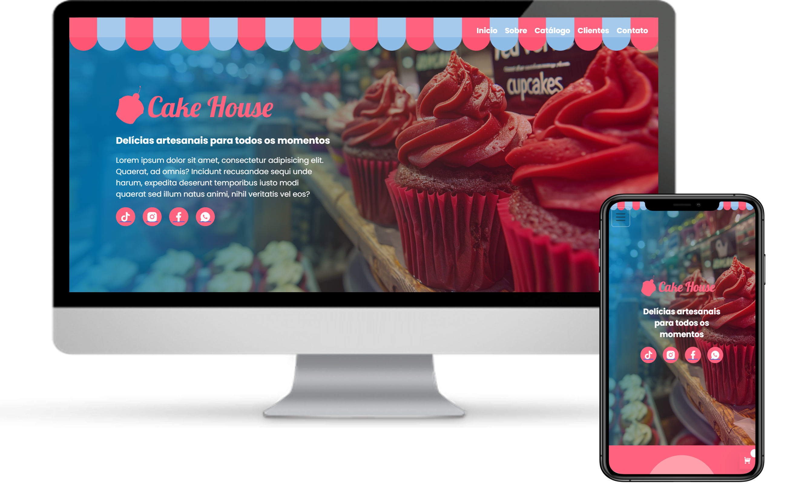

# Cake House Online
Projeto de landing page responsiva criado exclusivamente com HTML5, TailwindCSS, CSS3 e Javascript. Priorizando estrutura semântica, o design adaptável e código limpo.

## 💻 Demonstração

🔗 [Acesse aqui a versão online](https://cakehouseonline.netlify.app/)

## ✨ Recursos

- HTML5
- CSS3
- TailwindCSS
- Javascript
- Design responsivo
- Código limpo e organizado

## 📌 Observações

Este projeto foi desenvolvido com foco à atender negócios no ramo de confeitaria, priorizando a aplicação de boas práticas em desenvolvimento front-end.

## 📬 Contato

- [GitHub Profile](https://github.com/VictorBonifac10) 
- [LinkedIn](https://www.linkedin.com/in/victor-alves-bonifacio/)
